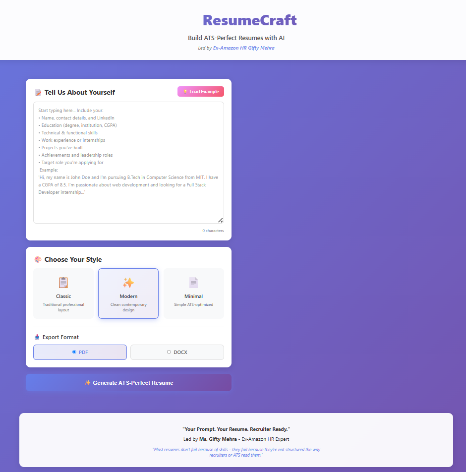
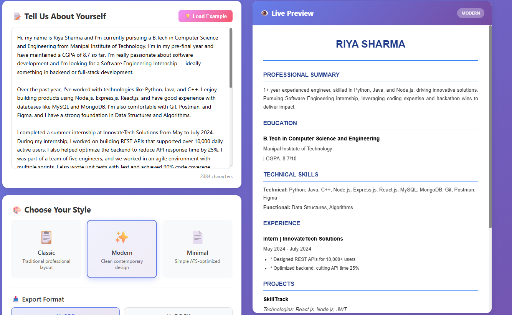
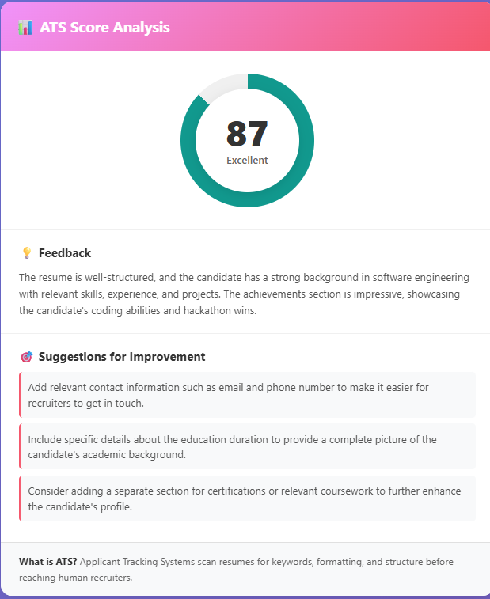

<div align="center">

# 📄 ResumeCraft

### AI-Powered ATS-Perfect Resume Generator

**Led by Ex-Amazon HR Gifty Mehra**

[](https://reactjs.org/)
[](https://openai.com/)
[](https://nodejs.org/)

> *"Most resumes don't fail because of skills - they fail because they're not structured the way recruiters or ATS read them."* — **Gifty Mehra**

[Demo Video](#-demo-video) • [Features](#-features) • [Installation](#-installation) • [Screenshots](#-screenshots) • [Tech Stack](#-tech-stack)

</div>

---

## 🎥 Demo Video

> **Watch ResumeCraft in action!**

[📹 View Demo Video](./screenshots/Screen%20Recording%202025-11-02%20144610.mp4)

👆 **Watch the complete walkthrough** showing how ResumeCraft transforms a simple text prompt into a professional, ATS-optimized resume in seconds!

> Note: For GitHub, you may want to upload this video to YouTube or use Git LFS for large files

---

## 📸 Screenshots

<div align="center">

### Landing Page & Prompt Input

*Simple, intuitive interface - just describe yourself in natural language*

### Live Preview & Template Selection

*Real-time preview with 3 professional templates: Classic, Modern, and Minimal*

### ATS Score Analysis

*Get instant ATS score and actionable suggestions to improve your resume*

</div>

---

## 🚀 The Problem

Resumes are **critical** for job applications, yet most fail to make an impact:

- ❌ **Unclear formatting** and weak wording
- ❌ **Not ATS-compliant** - filtered out by Applicant Tracking Systems
- ❌ **Poor keyword optimization** - missing crucial terms
- ❌ **Ineffective descriptions** - lacking action verbs and metrics
- ❌ **Time-consuming** - hours spent on formatting

### 💡 The Solution: ResumeCraft

ResumeCraft **transforms a single text prompt** into a professional, recruiter-ready, ATS-compliant resume in under 30 seconds.

**Your Prompt. Your Resume. Recruiter Ready.** ✨

---

## ✨ Features

### 🎯 Core Features

| Feature | Description |
|---------|-------------|
| 🤖 **AI-Powered Parsing** | Intelligently extracts and structures information from natural language |
| 📝 **Auto-Generated Summary** | Creates compelling 2-line professional summaries |
| 🎨 **3 Professional Templates** | Classic, Modern, and Minimal designs |
| 📥 **Multiple Formats** | Export as PDF or DOCX |
| ✅ **ATS-Optimized** | One-page layout with proper formatting for ATS systems |
| 🔤 **Smart Bullet Points** | Automatically enhances with action verbs and metrics |

### 🌟 Bonus Features

- ⭐ **ATS Score Meter** - Get a 0-100 score with detailed feedback
- 👁️ **Real-Time Preview** - See your resume as you build it
- 🔍 **Keyword Analysis** - Compare against job descriptions
- 💡 **Gap Analysis** - Identify missing skills and keywords
- ⚡ **Lightning Fast** - Generate resumes in seconds with Groq API

### 📋 Resume Sections (Auto-Generated)

✅ Header (Name, Contact, LinkedIn)  
✅ Professional Summary  
✅ Education  
✅ Technical & Functional Skills  
✅ Work Experience / Internships  
✅ Projects  
✅ Achievements & Leadership  

---

## 🛠️ Tech Stack

<div align="center">

### Backend


### Frontend


### Libraries & Tools


</div>

**Architecture:**
- RESTful API design
- Modular service layer architecture
- Environment-based configuration
- Multiple AI provider support (OpenAI, Groq, Gemini, Mock)

---

## 📦 Installation

### Prerequisites

- **Node.js** (v16 or higher) - [Download](https://nodejs.org/)
- **npm** or **yarn**
- **API Key** (choose one):
  - [Groq API](https://console.groq.com/keys) - **FREE & FAST** ⚡ (Recommended)
  - [OpenAI API](https://platform.openai.com/api-keys) - Paid
  - [Google Gemini API](https://aistudio.google.com/app/apikey) - FREE
  - Mock Service - No API needed (for testing)

### Quick Start

#### Option 1: Automated Setup (Windows)

```cmd
# Run the setup script
setup.bat
```

#### Option 2: Manual Setup

```bash
# 1. Clone the repository
git clone https://github.com/yourusername/ResumeCraft.git
cd ResumeCraft

# 2. Install backend dependencies
npm install

# 3. Install frontend dependencies
cd client
npm install
cd ..

# 4. Configure environment variables
cp .env.example .env
```

**Edit `.env` file:**
```env
PORT=5000

# Choose ONE AI provider (Groq recommended):
GROQ_API_KEY=your_groq_api_key_here
AI_SERVICE=groq

# Alternatives:
# OPENAI_API_KEY=your_openai_api_key
# GEMINI_API_KEY=your_gemini_api_key
# AI_SERVICE=mock  # No API needed for testing
```

```bash
# 5. Start the application
npm run dev
```

**Access the application:**
- Frontend: http://localhost:3000
- Backend API: http://localhost:5000

---

## 🎯 How to Use

### 1️⃣ **Enter Your Details**
Simply describe yourself in natural language. No forms, no templates!

```
Hi, my name is John Doe. I'm pursuing B.Tech in Computer Science 
from MIT with a CGPA of 8.5. I'm looking for a Software Engineering 
Internship. I have experience with Python, Java, React, and Node.js...
```

### 2️⃣ **Choose Your Style**
Select from 3 professional templates:
- **Classic** - Traditional corporate look (Black & Bold)
- **Modern** - Contemporary with blue accents
- **Minimal** - Ultra-clean for maximum ATS compatibility

### 3️⃣ **Select Format**
Choose PDF or DOCX export format

### 4️⃣ **Generate & Download**
Click "Generate ATS-Perfect Resume" and watch the magic happen! ✨

### 5️⃣ **Review ATS Score**
Check your ATS score and get suggestions for improvement

---

## 📊 AI Service Comparison

| Provider | Cost | Speed | Quality | Setup | Recommended |
|----------|------|-------|---------|-------|-------------|
| **Groq** | 🆓 Free | ⚡⚡⚡ Ultra Fast | ⭐⭐⭐⭐⭐ | Easy | ✅ **YES** |
| OpenAI | 💵 Paid | 🐌 Slow | ⭐⭐⭐⭐⭐ | Easy | For production |
| Gemini | 🆓 Free | 🚶 Medium | ⭐⭐⭐⭐ | Easy | Alternative |
| Mock | 🆓 Free | ⚡⚡⚡ Instant | ⭐⭐⭐ | None | Testing only |

**Free Tier Limits:**
- Groq: 14,400 requests/day
- Gemini: 1,500 requests/day
- Mock: Unlimited

---

## 🏆 Project Highlights

### Why This Project Stands Out

✨ **Innovation**
- Natural language processing - no rigid forms
- AI-powered content enhancement
- Real-time ATS scoring

💻 **Technical Excellence**
- Clean, modular architecture
- Multiple AI provider support
- RESTful API design
- Responsive UI/UX

🎯 **Real-World Value**
- Solves actual recruiting challenges
- Based on ex-Amazon HR insights
- Production-ready code quality

📈 **Scalability**
- Supports multiple AI providers
- Easy to extend with new features
- Environment-based configuration

---

## 📁 Project Structure

```
ResumeCraft/
├── 📂 server/                 # Backend
│   ├── server.js              # Express server
│   ├── 📂 routes/             # API routes
│   ├── 📂 controllers/        # Request handlers
│   └── 📂 services/           # Business logic
│       ├── aiService.js       # OpenAI integration
│       ├── groqService.js     # Groq integration
│       ├── geminiService.js   # Gemini integration
│       ├── mockAIService.js   # Mock service
│       ├── pdfGenerator.js    # PDF creation
│       └── docxGenerator.js   # DOCX creation
├── 📂 client/                 # Frontend
│   ├── 📂 src/
│   │   ├── 📂 components/     # React components
│   │   ├── App.js             # Main component
│   │   └── index.js           # Entry point
│   └── 📂 public/
├── 📂 generated-resumes/      # Output folder
├── 📄 package.json            # Dependencies
├── 📄 .env                    # Configuration
└── 📄 README.md               # You are here!
```

---

## 🎓 Hackathon Information

This project was built for the **ResumeCraft Hackathon** led by **Ms. Gifty Mehra**, an ex-Amazon HR expert.

### Submission Checklist
- ✅ Complete source code on GitHub
- ✅ Demo video showing all features
- ✅ Comprehensive README with screenshots
- ✅ Working application (tested)
- ✅ All required features implemented
- ✅ Bonus features included

---

## 🐛 Troubleshooting

<details>
<summary><b>Port already in use</b></summary>

Change the port in `.env`:
```env
PORT=5001
```
</details>

<details>
<summary><b>API key errors</b></summary>

- Verify your API key is correct
- Check if you have sufficient credits/quota
- Ensure no extra spaces in `.env` file
- Try the Mock service for testing: `AI_SERVICE=mock`
</details>

<details>
<summary><b>Module not found</b></summary>

```bash
npm run install-all
```
</details>

<details>
<summary><b>Resume not generating</b></summary>

1. Check server logs for errors
2. Verify API service is running
3. Try with example prompt
4. Switch to Mock service temporarily
</details>

---

## 🚀 Future Enhancements

- [ ] Multiple language support
- [ ] Cover letter generation
- [ ] LinkedIn profile optimization
- [ ] Resume comparison tool
- [ ] Job matching algorithm
- [ ] Browser extension
- [ ] Mobile app

---

## 📝 License

MIT License - feel free to use this project for learning and development!

---

## 👨‍💻 Author

**Sarang**
- GitHub: [@007-SARANG](https://github.com/007-SARANG)
- LinkedIn: [linkedin.com/in/sarangx](https://linkedin.com/in/sarangx)
- Email: sarangarora571@gmail.com

---

## 🙏 Acknowledgments

- **Ms. Gifty Mehra** - Ex-Amazon HR Expert, for hackathon mentorship and insights
- **Groq** - For providing fast and free AI API
- **OpenAI** - For GPT models
- **React & Node.js** communities

---

## ⭐ Star This Repository

If you found this project helpful, please give it a ⭐ on GitHub!

---

<div align="center">

### 🎯 Your Prompt. Your Resume. Recruiter Ready.

**Built with ❤️ for the ResumeCraft Hackathon**

[](https://github.com/yourusername/ResumeCraft)
[](your-demo-link)

</div>
